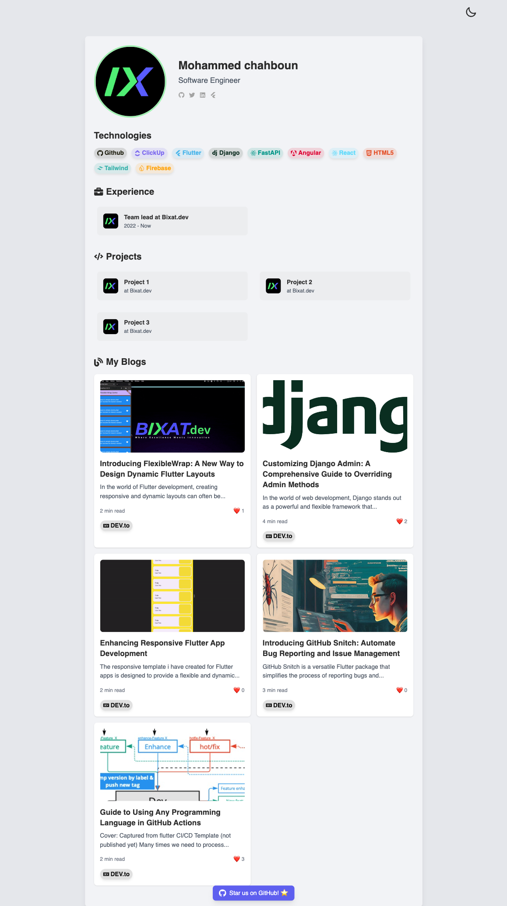

# Bixat Portfolio

This project is part of our landing page [Bixat.dev](https://bixat.dev), created as an open-source portfolio for use by other developers.

## Installation

To install this project, run:

```
git clone https://github.com/bixat/bixat-portfolio.git
cd bixat-portfolio
npm install
```

## Usage

Here's how to use the project:

1. Open the project folder
2. Update portfolio data on [`portfolio_data.ts`](./src/data/portfolio_data.ts)
3. Run `npm install ; npm start` to start the development server
4. Navigate to `http://localhost:3000` in your browser

## Screenshots

### Dark Theme


### Light Theme



## Contribution

Contributions to this project are welcome. If you have suggestions or improvements, please open an issue or submit a pull request on GitHub.

## License

This project is licensed under the MIT License - see the [LICENSE](LICENSE) file for details.